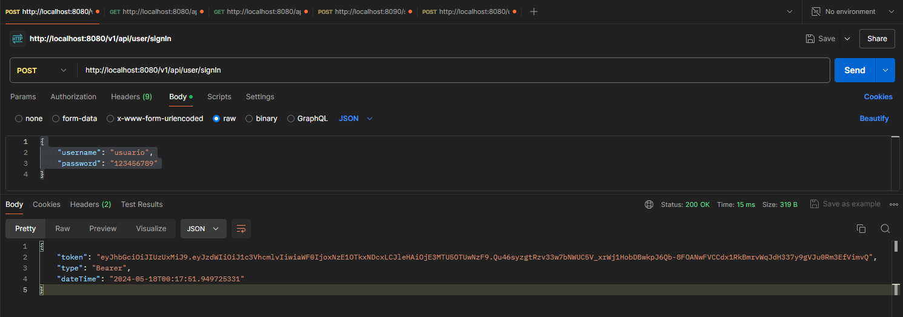

[](https://adoptium.net/es/temurin/releases/?os=windows&arch=any&package=jdk&version=17)

[](https://mvnrepository.com/artifact/org.projectlombok/lombok/1.18.32)


# API EXCHANGE (v1.0)

Api creado para consumir la siguiente 
URL: https://open.er-api.com/v6/latest/USD gratuita para el tipo de cambio, usando JWT, Spring Webflux, H2 y r2dbc.

## Instalación

1. Descargar el repositorio y ejecutar los siguientes comando para dockerizar:
    ```
    docker build -t exchange_rate:1.0 .
    docker run -p 8080:8080 --name app_exchange exchange_rate:1.0
    ```
   Deberia tener lo siguiente en docker Desktop:
   - Al ejecutar el primer comando
    
   - Al ejecutar el segundo comando
    

2. Al levantar el contenedor **app_exchange**, ingresar al postman con las siguientes rutas:
   ```
   ## RUTA PARA LOGIN
   http://localhost:8080/v1/api/user/signIn
   ```
   Aqui se debe usar el siguiente json en el body:
      ```
      {
          "username": "usuario",
          "password": "123456789"
      }
      ```
   Aqui deberia al ejecutar con el metodo POST la siguiente respuesta:
   

   ```
   ## RUTA PARA TIPO DE CAMBIO
   http://localhost:8080/api/v1/exchange
   ```
    AQUI DEBE INGRESAR EL TOKEN EN Bearer Token PARA CONSULTAR EL ENDPOINT
   
    ```
    {
        "amount": "500",
        "fromCurrency": "USD",
        "toCurrency": "PEN"
    }
    ```
   Aqui deberia al ejecutar con el metodo GET, obtener la siguiente respuesta:
   

   ```
   ## RUTA PARA LISTADO DE CAMBIO CONSULTADOS
   http://localhost:8080/api/v1/listexchangesave
   ```
   AQUI DEBE INGRESAR EL TOKEN EN Bearer Token PARA CONSULTAR EL ENDPOINT
    
   
## Recomendaciones

- El aplicativo esta en su primera verson, se seguira implementando nuevas librerías y actualizaciones.
- No olvidar que cada petición se debe agregar el JWT para que pueda funcionar los métodos.
